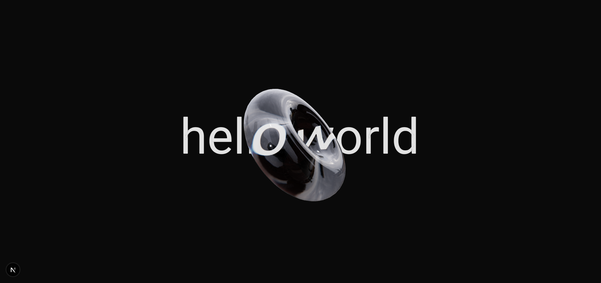

# Explination for the entern Question

## the code that should be explained:

```tsx
function Model() {
  const { viewport } = useThree();
  const torusRef = useRef<THREE.Mesh>(null);
  useFrame((state, delta) => {
    if (torusRef.current) {
      torusRef.current.rotation.x += 0.03;
    }
  });
  return (
    <group scale={viewport.width / 9}>
      <mesh ref={torusRef} rotation={[0, Math.PI / 4, 0]}>
        <torusGeometry args={[0.6, 0.3, 32, 64]} />
        <MeshTransmissionMaterial
          thickness={0.2}
          chromaticAberration={0.02}
          anisotropy={0.1}
          ior={1.5}
          backside
        />
      </mesh>
      <Text font="/fonts/font.ttf" position={[0, 0, -1]}>
        hello world
      </Text>
    </group>
  );
}
```
## the explaination

- the {viewprot} that is comming from useThree hook is for getting the screen dimension in the 3d space
- the toursRef is the ref For the mesh that we are creating and we will using it for animate the 3d mesh
- useFrame is a hook that is use to animate the 3d mesh in frame by frame 
- the MeshTransmissionMaterial that is comming from drei is a material that is use to create a glass effect
